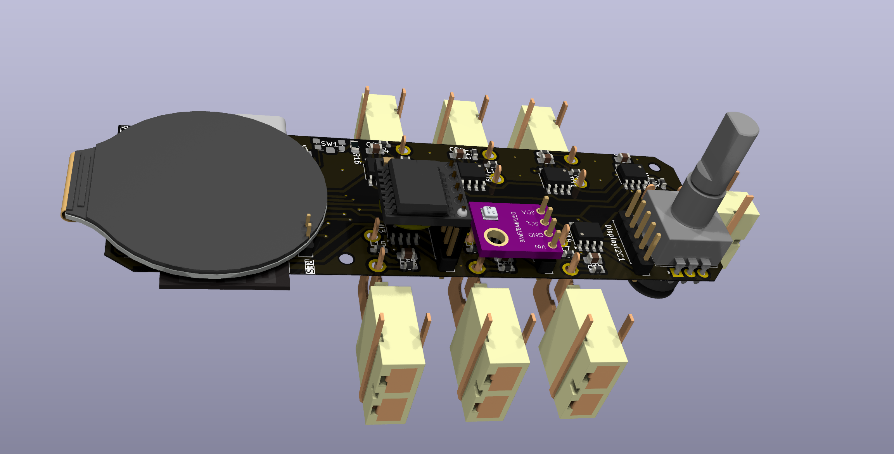
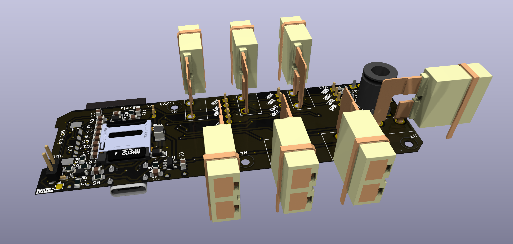
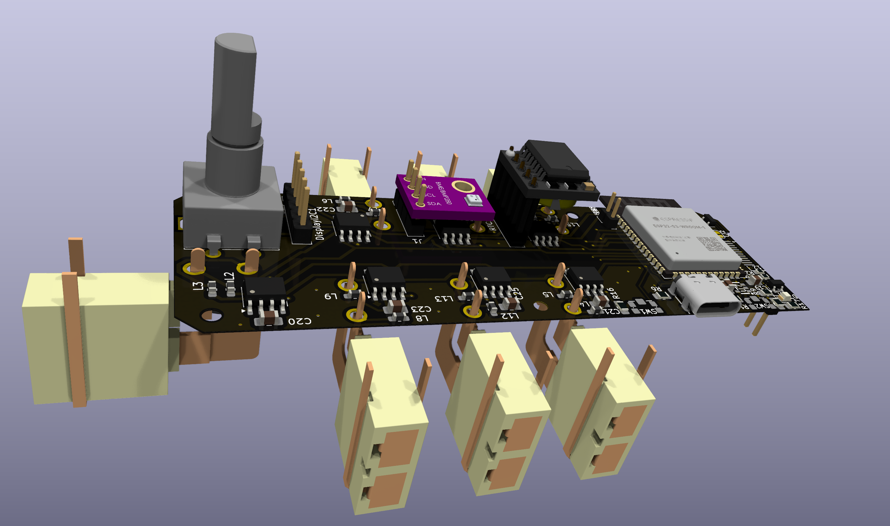
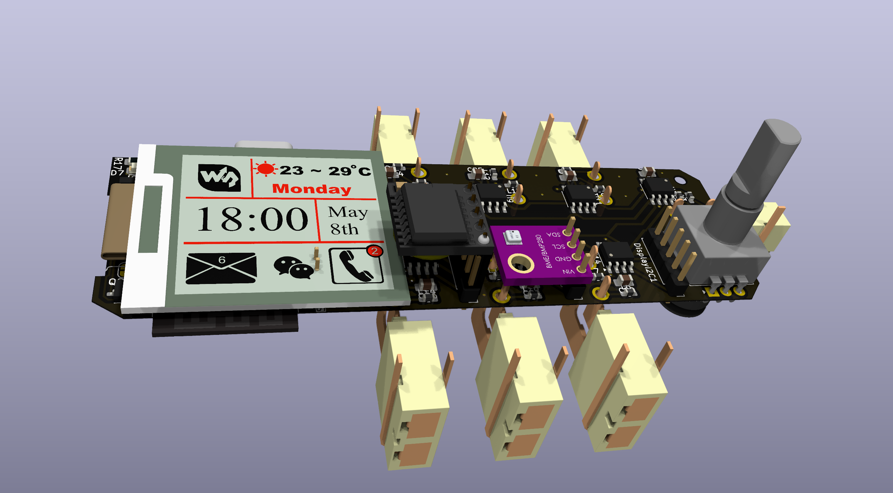

# SenseLoRaCAMSpeaker: The Programmable Addon Board for Xiao Sense S3 for LoRa and Audio

## Features:

1. **AudioAmplifier MAX98357**: Listen to your favourite Tunes with an Audio Amplifier

2. **7 or 8 x K - Type Connectors** Perfect for measuring your heating system

3. **Max31855 or Max31856 Thermo Sensors** High precision

4. **I2C Connector for Sensor**: Connect your favourite I2C Sensor board with the embedded 2.54mm connector

5. **MicroSD Card**: Perfect for storing your thermo logger Data

6. **Wireless Control**: Untehther your development process with the wireless capabilities. With WiFi and BLE, this tool allows remote control and data logging. Users can adjust settings and monitor data from a distance, offering a more flexible development experience.

7. **Open Source & Programmable**: As an open-source device, the Device offers unmatched versatility. It is fully programmable, allowing you to tailor its functionality to your specific applications. This customization extends to software and hardware, opening up endless possibilities for creative and efficient project development.

8. **Compact Design**: Designed for convenience, the Thermologger Board compact and sleek form factor allows for seamless integration into existing setups. Its compatibility with USB PD sources and inline integration capability minimizes the need for additional equipment or extensive redesign, making it a versatile and user-friendly addition to any development environment.

9. **Display**: Monitor live the current status of all Thermo Logger sources or I2C Sensors

10. **Jog Dial** for operating the Device

9. **RGB LED**: Status LED
## Specifications

### Key Features:

### Future Developments:
1. Home Assistant integration

2. Eink Display for Power Saving

## Testing for Performance

At the heart of ThermoLogger's design is a commitment to reliability and performance. To ensure that SenseLoRaCam stands up to real-world demands, we subjected it to testing under use conditions.

## License

MIT License

Copyright (c) 2025 blue2monster

Permission is hereby granted, free of charge, to any person obtaining a copy
of this software and associated documentation files (the "Software"), to deal
in the Software without restriction, including without limitation the rights
to use, copy, modify, merge, publish, distribute, sublicense, and/or sell
copies of the Software, and to permit persons to whom the Software is
furnished to do so, subject to the following conditions:

The above copyright notice and this permission notice shall be included in all
copies or substantial portions of the Software.

THE SOFTWARE IS PROVIDED "AS IS", WITHOUT WARRANTY OF ANY KIND, EXPRESS OR
IMPLIED, INCLUDING BUT NOT LIMITED TO THE WARRANTIES OF MERCHANTABILITY,
FITNESS FOR A PARTICULAR PURPOSE AND NONINFRINGEMENT. IN NO EVENT SHALL THE
AUTHORS OR COPYRIGHT HOLDERS BE LIABLE FOR ANY CLAIM, DAMAGES OR OTHER
LIABILITY, WHETHER IN AN ACTION OF CONTRACT, TORT OR OTHERWISE, ARISING FROM,
OUT OF OR IN CONNECTION WITH THE SOFTWARE OR THE USE OR OTHER DEALINGS IN THE
SOFTWARE.
